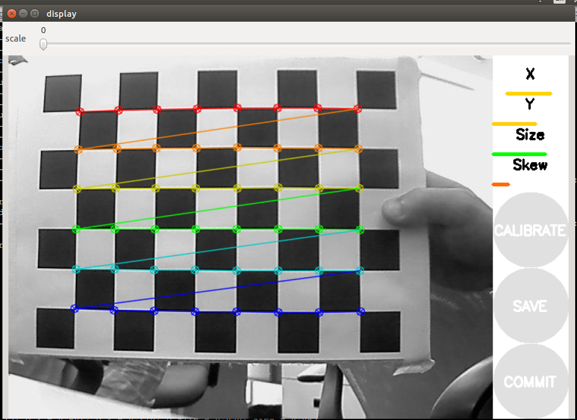
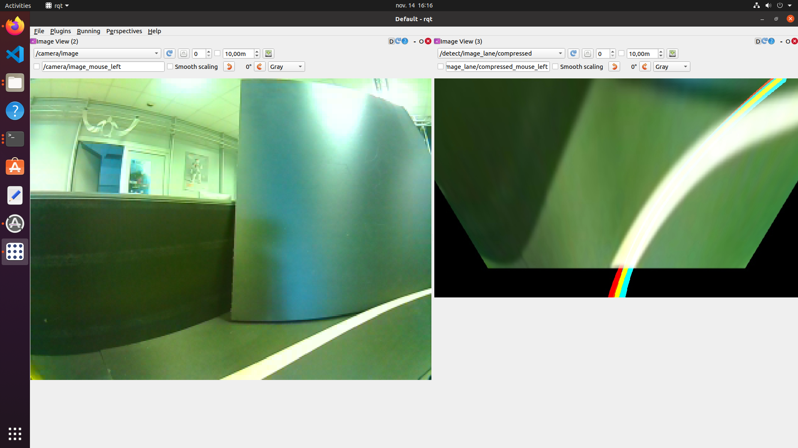

## Robotics Project MSCV


<p align="center">  
   
</p >

# <p align="center">University of Burgundy
</p > 

# <p align="center">Master of Computer vision and Robotics</p >   
<p align="center">  
   
</p >

# <p align="center">Robotics Project</p> 

## <p align="center">Under the guidance of:</p > 

<p align="center"> Joaquin RODRIGUEZ </p >     
<p align="center"> Raphael DUVERNE </p >   
<p align="center"> Renato MARTINS </p >   
 

## <p align="center">Team Members:</p >

<p align="center">REETIKA GAUTAM</p>
<p align="center">SEIKH MOHAMMED BASHARAT MONES</p>

## TABLES OF CONTENTS:


 1. [Aim of the project](https://github.com/Reetika12795/RoboticProject_2022#aim-of-the-project)

 2. [Introduction](https://github.com/Reetika12795/RoboticProject_2022#introductionabout-tutbot3type-of-camera-usedrobot-modules)

 3. [prerequisites for the project](https://github.com/Reetika12795/RoboticProject_2022#prerequisites-for-the-project)
 
 4. [Base architecture of the model](https://github.com/Reetika12795/RoboticProject_2022#base-architecture-of-the-modelcamera-caliberation-module----intrinsic-and-extrinsicreason-set-hsv-value-for-detect-lane-call-control-lane-for-path-averaging)
      1) **Extrinsic parameters**
      2) **HSV space to detect lane**
      3) **Control lane**
      4) **Intrinsic parameters**
   
 5. [Implementation of code and the steps to execute](https://github.com/Reetika12795/RoboticProject_2022#implementation-of-code-and-the-steps-to-execute)
    * Launch the robot
    * Intrinsic calibration
    * Ectrinsic calibration
    * Detecting the HSV lane from autorace
    * Control node

 6. [Flochart of the architecture](https://github.com/Reetika12795/RoboticProject_2022#flochart-of-the-architecture)
 7. [Challenges](https://github.com/Reetika12795/RoboticProject_2022#challenges)
 8. [Conclusion](https://github.com/Reetika12795/RoboticProject_2022#conclusion)
 9. [Demo Video](https://github.com/Reetika12795/RoboticProject_2022#demo-video)
10. [References](https://github.com/Reetika12795/RoboticProject_2022#references)


## AIM OF THE PROJECT:

* The bot will follow the path with detecting yellow line on it's left and white line on it's right in particular using autorace package.

* The bot will follow the mean path between these two detected lines.

* Even if it detects any one line with it's associated color the bot will behave normal.

* The bot must be able to pass through the tunnel. 


 
## INTRODUCTION:

The Robot Operating System (ROS) is an open source framework with a set of software libraries and tools that help us build robot application in a fastest way possible to build a robot! ROS provides standard operating system services such as hardware abstraction, low-level device control, implementation of commonly-used functionality, message-passing between processes, and package management. For our project we will use ROS Noetic.

The type of robot we program in our project is (TurtleBot3--). The turtlebot3 burger has the sensor such as a 360 Laser Distance Sensor and a Raspberry Pi Camera Module, control borads such as OpenCR1.0 (for low level control) and a Single Board Computer Raspberry Pi 3B+(for high level control and running ros Nodes). 


For Atonomous driving the camera module that we use for navigation is the raspi cam node which needs caliberation of both intrinsic and extrinsic parameters as to remove the effect of distortion to the images.


## PRE-REQUISITES OF THIS PROJECT:

The Robot has to follow the lanes with yellow on the left and white on the right and the distance between the lane remains constant throught most part of the track (even in turns and in the tunnel). 

The robot has to autonomously drive between the two colored detected lines.

## BASE ARCHITECTURE OF OUR MODEL:

Camera calibration is one of the most important steps in order to run the turtle bot properly on the track. For camera calibration, we do two calibrations for intrinsic paramemters and extrinsic parameters. 

**Intrinsic parameters** - Intrinsic parameters are the parameters for the optical centre and the focal length of the camera. 


A checker board pattern is used for the calibration of the intrinsic parameters.




**Extrinsic parameters** - Extrinsic parameters are the parameters for the surroundings of the camera relative to rotation and translation. It helps to view the world objects from camera perspective.

**HSV space to detect lane** - For detecting the lanes, HSV values have been used. The bot is detecting the yellow line on the left and white line on the right with the HSV values of yellow and white respectively detected by the realtime image received from the turtlebot camera. 
P.S. - HSV values are sensitive to lighting conditions. But we have tried some image processing techniques to resolve it.

**Control lane** - The motive of the project is to move the turtlebot keeping it between the lines. After detection of the proper line on proper side, The robot should calculate he average of the lines and keep moving by following the average line. \In case of un availability of a line, as long as the other line is being detected, the robot should move in its desired path. To do that, the algorithm makes a line that should be the average line and creates a line by adding a distance from the detected line os that the bot can move swiftly.


&emsp;&emsp;&emsp;&emsp;&emsp;&emsp;&emsp; (1) &emsp;&emsp;&emsp;&emsp;&emsp;&emsp;&emsp;&emsp;&emsp;&emsp;&emsp;&emsp;&emsp;&emsp; (2) &emsp;&emsp;&emsp;&emsp;&emsp;&emsp;&emsp;&emsp;&emsp;&emsp;&emsp;&emsp;&emsp;&emsp; (3) &emsp;&emsp;&emsp;&emsp;&emsp;&emsp;&emsp;&emsp;&emsp;&emsp;&emsp;&emsp;&emsp;&emsp; (4)


Above in images,
Image(1) - Both the lines left(yellow) and right(white) are visible and the average line(yellow in the middle) is created properly.\
Image(2) - Left line is detected properly and right line is not in the view but still we have the average line.\
Image(3) - Right line is detected properly and left line is not present in the view but the average line is being viewed properly.\
Image(4) - Sometimes both the lines are detected on the lane but still the algorithm gets confused for to the poor image reception due to lighting conditions.

## Implementation of code and the steps to execute

#### Launch the robot

* At very first we connect with Roscore to allow all the ROS nodes communications with each other.  
launch roscore on the *Remote PC*.
```
$ roscore
```
* launch the turtlebot3 bringup in the Single Borad Computer(*SBC*) this strats the turtlebot3_core Node and starts publishing,subscribing the information between the SBC and sensor,actuators. 
```
$ roslaunch turtlebot3_bringup turtlebot3_robot.launch
```
This package does not come directly with a ros install; you may have to install it yourself either via apt.
```
run sudo apt install ros-<your_distro>-turtlebot3-bringup
```
Then just source /opt and run the command.


* From turtlebot3_autorace_camera launch raspberry pi camera *SBC*:
```
$ roslaunch turtlebot3_autorace_camera raspberry_pi_camera_publish.launch
```

#### Intrinsic Calibration

Launch the intrinsic camera caliberation file on *Remote PC* to caliberate the rospicam instrinsics:
```
$ roslaunch turtlebot3_autorace_camera intrinsic_camera_calibration.launch mode:=calibration
```


Once the image is in good contrast, sharper the parameter can be save in a **yaml** file to used in the next step and kill the node.

#### Extrinsic Calibration
- Extrinsic Calibration which modifies the perspective of the image in the red trapezoid and helps in getting the ROI for out bot.
Run this node on the *Remote PC* in caliberation mode .
```
$ roslaunch turtlebot3_autorace_camera extrinsic_camera_calibration.launch mode:=calibration
$ rosrun rqt_reconfigure rqt_reconfigure
```
* Change the parameters of the file turtlebot3_autorace_2020/turtlebot3_autorace_camera/calibration/extrinsic_caliberation/projection.yaml


* Once the values are updated, Kill the node and launch it in action mode with the following command on the *Remote PC* 
```
$ roslaunch turtlebot3_autorace_camera extrinsic_camera_calibration.launch mode:=action
```

### Detecting the HSV lane from autorace:
* Launch the following command to detect the HSV values of yellow and white for the projected image from the node /camera/image_projected_compensated
```
$ roslaunch turtlebot3_autorace_detect detect_lane.launch mode:=calibration
$ rosrun rqt_reconfigure rqt_reconfigure
```
Open lane.yaml file located in turtlebot3_autorace_detect/param/lane/ and update the values where you can distinguish the yellow and white lane properly.


Once the values are updated, Kill the node and launch it in action mode with the following command on the *Remote PC* 
```
$ roslaunch turtlebot3_autorace_detect detect_lane.launch mode:=action
```

***Since there exists ambiguity while distinguishing the yellow and white we try to equalize the intensity of the image received from autorace detect lane package.***
launch this file which subscribes to /camera/image_projected_compensated node and publish it's data on 'eql_img' node
```
rosrun turtlebot3_autorace_camera hist_equalize.py
```

#### Control node
* For the final step we launch the control node of the turtlebot that allows it to stay between the two detected lines :

launch the command on your 'remote PC' 
```
roslaunch turtlebot3_autorace_driving turtlebot3_autorace_control_lane.launch
```
Volla!! your robot will start to floow the path between the yellow and white lines

## Flochart of the architecture

## Conclusion:

Moving a mobile robot autonomously is a difficult task especially if we are working with color based detection. To move a robot we first tried to understand the architechture of Robot operating system and how it communicates with each other through ROS messages and ROS topic/services.
we use OpenCV bridge to preform some pre processing to autorace images and publish it as a topic list to ROS. histogram equalization to used to equalize the colourband of the detected lanes and this approach  helped  improve the detection of the lane to being able to move within the lane even in low lighing conditions inside the tunnel. 

## Demo Video:


<!-- https://user-images.githubusercontent.com/116564367/206717401-5cf35e06-8680-4d73-9c17-cc9b7e7b7c8a.mp4 -->


https://user-images.githubusercontent.com/116564367/206747824-566d8dd0-aebe-415f-8e7d-0e47473c8338.mp4


https://www.youtube.com/watch?v=-YWwjlGPxko \
https://youtu.be/e2C2EWr9nHM

## Challenges:
If the yellow line is detected as white line due to poor lightning conditions the bot will face problems while taking a turn.




## References:
https://emanual.robotis.com/docs/en/platform/turtlebot3/autonomous_driving/
